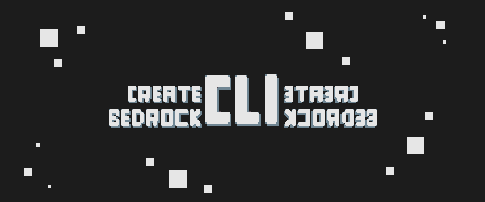

# Create MC Bedrock CLI

<div align="center">

[](https://github.com/keyyard/create-mc-bedrock-cli)
[](https://github.com/keyyard/create-mc-bedrock-cli)
[](https://nodejs.org/)
[](LICENSE)

[](https://bedrockcli.keyyard.xyz/)

<br/>



</div>

**The Fastest Way to Start Minecraft Bedrock Addon Development! 🚀**
</div>

---

**Tired of manually setting up Minecraft Bedrock workspaces?**  
With `create-mc-bedrock`, you can bootstrap your next project in seconds, using official Microsoft samples and fresh manifest UUIDs every time.

## Table of Contents
- [✨ Why Use Create MC Bedrock CLI?](#-why-use-create-mc-bedrock-cli)
- [🚀 How It Works](#-how-it-works)
- [📸 Showcase](#-showcase)
- [🛠️ Features](#-features)
- [📦 Requirements](#-requirements)
- [💡 Pro Tips](#-pro-tips)
- [🤝 Contributing](#-contributing)
- [📄 License](#-license)
- [🙏 Credits](#-credits)

## ✨ Why Use Create MC Bedrock CLI?

### ⚡ **Instant Project Setup**

No more copy-pasting or manual configuration. Select a sample, pick a folder, and your workspace is ready to go—complete with unique manifest UUIDs.

### 🧠 **Focus on Building, Not Boilerplate**

Spend your time creating, not setting up. All the essentials are handled for you, so you can jump straight into development.

### 🔒 **Always Unique, Always Clean**

Every project is generated with new manifest UUIDs, ensuring no conflicts and a smooth import into Minecraft.

### 🗂️ **Official Samples, Your Way**

Choose from a curated list of Microsoft’s best scripting samples. Your selected template is cloned directly into your chosen folder—no nested directories, no confusion.

---

## 🚀 How It Works

1. **Run the CLI:**
   ```bash
   npx create-mc-bedrock
   ```
2. **Follow the Prompts:**
   - Select a sample project (⭐ `ts-starter` is recommended for TypeScript users!)
   - Choose your destination folder
3. **Start Coding:**
   - Your workspace is ready, with all manifests updated and temp files cleaned up.

---

## 📸 Showcase

<div align="center">
    
    
    
</div>

---

## 🛠️ Features

- Interactive CLI with sample selection
- Direct cloning to your specified folder (no more nested directories)
- Automatic manifest UUID regeneration for every project
- Supports both JavaScript and TypeScript samples
- Cleans up temporary files after setup

---

## 📦 Requirements

- Node.js 18 or higher
- Git

---

## 💡 Pro Tips

- Use the ⭐ `ts-starter` template for a modern TypeScript setup.
- Run the CLI with `npx` for the latest version every time.
- All generated projects are ready to open in VS Code—just `cd` into your folder and run `code .`

---

## 🤝 Contributing

We’d love your help to make Create MC Bedrock CLI even better!  
Whether you have ideas, spot a bug, or want to share new samples, your contributions are always welcome.

Want to add a new workspace template?  
Simply open a pull request to the [Custom MC Scripting Templates](https://github.com/Keyyard/custom-mc-scripting-templates) repository.

Every suggestion, issue, or PR helps the community grow—jump in and let’s build something awesome together!

---

## 🙏 Credits

- **Beyond64** ([OsmaanGani](https://github.com/OsmaanGani)): Package banner artist
- **PottedPropagule** ([PottedPropagule](https://github.com/PottedPropagule)): Issue reporter and helpful feedback

---

## ⭐ Stargazers Over Time

<a href="https://www.star-history.com/#Keyyard/create-mc-bedrock-cli&Date">
 <picture>
   <source media="(prefers-color-scheme: dark)" srcset="https://api.star-history.com/svg?repos=Keyyard/create-mc-bedrock-cli&type=Date&theme=dark" />
   <source media="(prefers-color-scheme: light)" srcset="https://api.star-history.com/svg?repos=Keyyard/create-mc-bedrock-cli&type=Date" />
   
 </picture>
</a>

<div align="center">
  **Made with ❤️ for the Minecraft Bedrock dev community**  
  <br/>
  <a href="https://github.com/keyyard/create-mc-bedrock-cli/stargazers">
    ⭐ Star us on GitHub
  </a>
</div>
